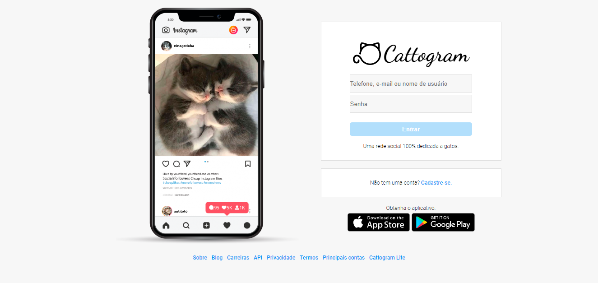

# Cat-Only Instagram Clone
Cattogram is a Front-End Instagram Clone. It is a work in progress, as it only has the front to the login page, with no JS or interactivity included yet. This was made for the Impulso Javascript Bootcamp from [DIO](https://web.dio.me/track/impulso-javascript-evolution "DIO Impulso Javascript Bootcamp").

## URL
You can access the live version at https://amandaalexandre.github.io/cattogram/.

## Stack utilized
This will soon change, since this project will be refactored into a MERN stack after the Impulso Javascript Bootcamp is finished.
- CSS (Flexbox and Grid)
- HTML

## Expected layout

